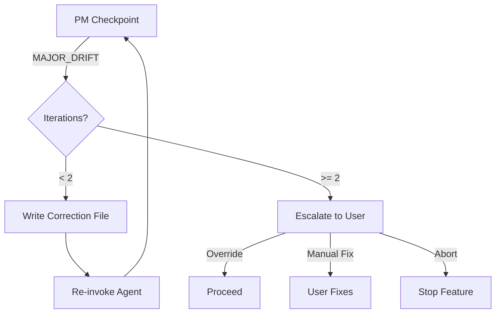
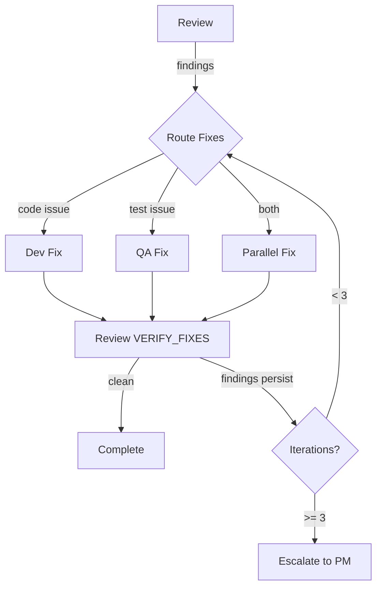
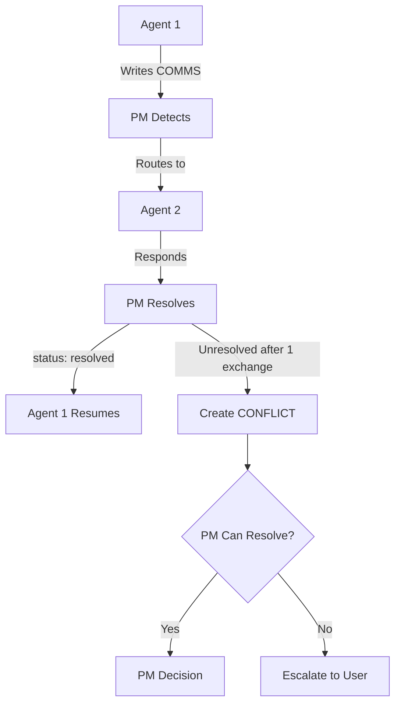

# SpecFlow Workflow Map

**Version:** v2.5
**Documented:** 2026-02-04
**Source:** `slash-commands/sf-pm.md`, `.specflow-lib/expertise/agent-pattern.md`

## Executive Summary

SpecFlow implements a PM-orchestrated, file-based workflow where agents execute autonomously and return to PM for routing decisions. The PM engages users only for "big decisions" (scope >= medium, conflicts, escalations).

---

## 1. High-Level Flow Diagram

```mermaid
graph TD
    subgraph "User Entry"
        U[User Request] -->|/sf:pm "feature"| PM1[PM Triage]
    end

    subgraph "Triage Phase"
        PM1 -->|Detect triggers| PT{Pillar Selection}
        PT -->|Create 0-triage.md| SC[Scope Assessment]
        SC -->|Analyst creates 0-scope.md| PM2{PM Scope Approval}
    end

    subgraph "Scope Gate"
        PM2 -->|trivial/small| AUTO[Auto-Approve]
        PM2 -->|medium+| USER1[User Confirms]
        USER1 -->|APPROVE| AUTO
        USER1 -->|SCALE_UP/DOWN| SC
        AUTO --> SPEC[Specification Phase]
    end

    subgraph "Specification Phase"
        SPEC -->|Analyst| CBASE[Codebase Analysis]
        CBASE -->|1.5-codebase-constraints.md| SPEC2[Spec Creation]
        SPEC2 -->|1-spec.md| PM3[PM Review]
    end

    subgraph "Optional: UX Phase"
        PM3 -->|UI-heavy detected| UX[UX Design]
        UX -->|1.6-ux-design.md| PM3B[PM Routes to Architect]
        PM3 -->|No UI| PM3B
    end

    subgraph "Pillar Phases"
        PM3B --> ARCH[Architect]
        ARCH -->|2-architecture.md| PM4[PM Review]
        PM4 -->|Security pillar| SEC[Security]
        PM4 -->|No security| COST_CHECK{Cost Pillar?}
        SEC -->|3-security.md| COST_CHECK
        COST_CHECK -->|Cost pillar| COST[Cost]
        COST_CHECK -->|No cost| TEA[TEA]
        COST -->|4-cost.md| TEA
        TEA -->|5-test-plan.md| SYNTH[PM Synthesis Gate]
    end

    subgraph "Synthesis Gate"
        SYNTH -->|Creates 5-requirements-lock.md| SG{Scope Check}
        SG -->|trivial/small| AUTO_LOCK[Auto-Approve Lock]
        SG -->|medium+| USER2[User Approves Lock]
        USER2 --> AUTO_LOCK
    end

    subgraph "Execution Phase"
        AUTO_LOCK -->|qa-first| QA_TDD[QA TDD Mode]
        AUTO_LOCK -->|dev-only| DEV[Dev]
        QA_TDD -->|5-qa-tests.md| DEV
        DEV -->|6-dev-output.md| PM_CP1[PM Dev Checkpoint]
        PM_CP1 -->|ALIGNED| QA_VERIFY[QA Verify]
        PM_CP1 -->|DRIFT| DEV
        QA_VERIFY -->|7-qa-output.md| PM_CP2[PM QA Checkpoint]
        PM_CP2 -->|ALIGNED| REVIEW[Review]
        PM_CP2 -->|DRIFT| QA_VERIFY
    end

    subgraph "Review Phase"
        REVIEW -->|Skill detection| SKILLS[Parallel Skills]
        SKILLS -->|8-review-output.md| RV{Review Status}
        RV -->|clean| COMPLETE[Complete]
        RV -->|findings| FIX[Fix Loop]
        FIX --> SKILLS
        RV -->|escalated| USER3[User Decision]
        USER3 --> COMPLETE
    end
```

---

## 2. Scope-Variant Flows

### 2.1 Trivial Scope

**Characteristics:** 1 file, typo fix, config change
**Pillars:** None

```mermaid
graph LR
    U[User] -->|/sf:pm "fix typo"| PM[PM Triage]
    PM -->|pillars: []| AN[Analyst]
    AN -->|0-scope.md| PM2[PM Auto-Approve]
    PM2 --> DEV[Dev]
    DEV --> DONE[Complete]
```

**Notes:**
- PM auto-approves scope (no user gate)
- No pillar agents invoked
- No synthesis gate
- Direct to dev, no QA

### 2.2 Small Scope

**Characteristics:** 1-3 files, simple feature
**Pillars:** [testing]

```mermaid
graph LR
    U[User] -->|/sf:pm "add button"| PM[PM Triage]
    PM -->|pillars: testing| AN[Analyst]
    AN -->|0-scope.md| PM2[PM Auto-Approve]
    PM2 --> AN2[Analyst Spec]
    AN2 -->|1-spec.md| ARCH[Architect]
    ARCH -->|2-architecture.md| TEA[TEA]
    TEA -->|5-test-plan.md| SYNTH[PM Synthesis]
    SYNTH -->|Auto-approve lock| DEV[Dev]
    DEV --> QA[QA]
    QA --> REVIEW[Review]
    REVIEW --> DONE[Complete]
```

**Notes:**
- PM auto-approves scope and lock (no user gates)
- Testing pillar only
- Security and Cost skipped
- Review runs code-quality skills

### 2.3 Medium Scope

**Characteristics:** 3-10 files, new endpoint, significant feature
**Pillars:** [security, testing] or [security, cost, testing]

```mermaid
graph TD
    U[User] -->|/sf:pm "add logout"| PM[PM Triage]
    PM -->|Security trigger: session mgmt| AN[Analyst Scope]
    AN -->|0-scope.md| PM2{PM Reviews}
    PM2 -->|medium scope| USER1[User Confirms]
    USER1 -->|APPROVE| AN2[Analyst Codebase]
    AN2 -->|1.5-codebase-constraints.md| AN3[Analyst Spec]
    AN3 -->|1-spec.md| ARCH[Architect]
    ARCH -->|2-architecture.md| SEC[Security]
    SEC -->|3-security.md| TEA[TEA]
    TEA -->|5-test-plan.md| SYNTH{PM Synthesis}
    SYNTH -->|5-requirements-lock.md| USER2[User Approves Lock]
    USER2 --> DEV[Dev]
    DEV --> PM_CP[PM Checkpoint]
    PM_CP --> QA[QA]
    QA --> PM_CP2[PM Checkpoint]
    PM_CP2 --> REVIEW[Review]
    REVIEW --> DONE[Complete]
```

**Notes:**
- Two user gates: scope approval and lock approval
- Security pillar included for session/auth work
- Full drift checkpoints after Dev and QA
- Review with security skill

### 2.4 Large Scope

**Characteristics:** 10+ files, payment integration, major feature
**Pillars:** [security, cost, testing]

```mermaid
graph TD
    U[User] -->|/sf:pm "add payments"| PM[PM Triage]
    PM -->|All triggers| AN[Analyst Scope]
    AN -->|0-scope.md| USER1[User Confirms Scope]
    USER1 --> AN2[Analyst Codebase]
    AN2 -->|1.5-codebase-constraints.md| AN3[Analyst Spec]
    AN3 -->|1-spec.md| ARCH[Architect]
    ARCH -->|2-architecture.md| SEC[Security]
    SEC -->|3-security.md| COST[Cost]
    COST -->|4-cost.md| TEA[TEA]
    TEA -->|5-test-plan.md| SYNTH{PM Synthesis}
    SYNTH -->|5-requirements-lock.md| USER2[User Approves Lock]
    USER2 -->|qa-first recommended| QA_TDD[QA TDD]
    QA_TDD -->|5-qa-tests.md| DEV[Dev]
    DEV --> PM_CP[PM Dev Checkpoint]
    PM_CP --> QA_V[QA Verify]
    QA_V --> PM_CP2[PM QA Checkpoint]
    PM_CP2 --> REVIEW[Review]
    REVIEW --> DONE[Complete]
```

**Notes:**
- All three pillars
- qa-first flow (QA writes tests before Dev)
- Full review with security + code quality skills
- Multiple user gates possible

### 2.5 Complex Scope

**Characteristics:** Many files, new service, research required
**Pillars:** All + Research Phase

```mermaid
graph TD
    U[User] -->|/sf:pm "build microservice"| PM[PM Triage]
    PM -->|Uncertainty detected| BRAIN[Brainstorm]
    BRAIN -->|0.3-brainstorm.md| PM2[PM Informed]
    PM2 --> AN[Analyst Scope]
    AN -->|0-scope.md: complex| USER1[User Confirms]
    USER1 --> AN2[Analyst Codebase]
    AN2 -->|Extensive analysis| AN3[Analyst Spec]
    AN3 -->|1-spec.md: 20+ ACs| ARCH[Architect]
    ARCH -->|Deep ADRs| SEC[Security]
    SEC -->|Full STRIDE| COST[Cost]
    COST -->|Full breakdown| TEA[TEA]
    TEA -->|15+ test scenarios| SYNTH{PM Synthesis}
    SYNTH --> USER2[User Approves Lock]
    USER2 --> EXEC[Full Execution Flow]
    EXEC --> DONE[Complete]
```

**Notes:**
- Brainstorm phase may precede triage
- Deep analysis at every stage
- Multiple iteration cycles expected
- Escalation paths more likely

---

## 3. Phase Documentation

### Phase: PM Triage

| Field | Content |
|-------|---------|
| Entry Point | User invokes `/sf:pm "description"` |
| Inputs | User description, STATE.md |
| Outputs | 0-triage.md, STATE.md updated |
| Exit Criteria | Pillar selection complete, slug generated |
| Handoff | Analyst (for scope assessment) |

**Key Logic (sf-pm.md lines 55-86):**
- Security triggers: auth, session, PII, payment, API, file upload, external service
- Cost triggers: cloud resources, third-party APIs, background jobs, data processing
- Testing: always unless pure docs

### Phase: Scope Assessment (Analyst)

| Field | Content |
|-------|---------|
| Entry Point | PM routes after triage |
| Inputs | 0-triage.md, user description |
| Outputs | 0-scope.md |
| Exit Criteria | Scope level determined, pillar selection validated |
| Handoff | PM (for scope approval) |

**Scope Levels:**
| Level | Files | Spec Depth | Arch Depth |
|-------|-------|------------|------------|
| trivial | 1 | 1-2 ACs | Skip |
| small | 1-3 | 3-5 ACs | Light |
| medium | 3-10 | 8-12 ACs | Standard |
| large | 10+ | 15+ ACs | Full |
| complex | Many | 20+ ACs | Deep + ADRs |

### Phase: Scope Approval (PM)

| Field | Content |
|-------|---------|
| Entry Point | Analyst returns with 0-scope.md |
| Inputs | 0-scope.md, 0-triage.md |
| Outputs | 0-scope.md updated with approval |
| Exit Criteria | Scope approved (auto or user) |
| Handoff | Analyst (for codebase analysis and spec) |

**Approval Logic (sf-pm.md lines 144-226):**
| Condition | Action |
|-----------|--------|
| scope < medium | Auto-approve |
| scope >= medium | User confirmation required |
| High-risk domain | User confirmation regardless of scope |
| Pillar mismatch | SCALE_UP or SCALE_DOWN |

### Phase: Codebase Analysis (Analyst)

| Field | Content |
|-------|---------|
| Entry Point | PM approves scope |
| Inputs | Codebase, 0-scope.md |
| Outputs | 1.5-codebase-constraints.md |
| Exit Criteria | Tech stack, patterns, integration points documented |
| Handoff | PM (routes to spec creation) |

**Output Contains:**
- Tech stack detection (frameworks, libraries)
- Existing patterns (auth, API, database access)
- Integration points (files that must be touched)

### Phase: Spec Creation (Analyst)

| Field | Content |
|-------|---------|
| Entry Point | PM routes after codebase analysis |
| Inputs | 0-scope.md, 1.5-codebase-constraints.md |
| Outputs | 1-spec.md |
| Exit Criteria | BOSS-compliant acceptance criteria |
| Handoff | PM (routes to UX or Architect) |

**BOSS Criteria:**
- Binary: Pass/fail, no partial
- Observable: Externally verifiable
- Specific: One behavior per criterion
- Scope-bound: Within feature boundaries

### Phase: UX Design (Optional)

| Field | Content |
|-------|---------|
| Entry Point | PM detects UI-heavy feature |
| Inputs | 0-scope.md, 1-spec.md |
| Outputs | 1.6-ux-design.md |
| Exit Criteria | Component strategy, accessibility requirements |
| Handoff | PM (routes to Architect with UX context) |

**Trigger Keywords (sf-pm.md lines 343-388):**
- interface, UI, UX, user experience
- screen, form, flow, dashboard, page
- responsive, mobile, accessibility

### Phase: Architecture (Architect)

| Field | Content |
|-------|---------|
| Entry Point | PM routes after spec (and UX if applicable) |
| Inputs | 1-spec.md, 1.5-codebase-constraints.md, 1.6-ux-design.md (if exists) |
| Outputs | 2-architecture.md |
| Exit Criteria | Technical decisions documented, file structure proposed |
| Handoff | PM (routes to Security or next pillar) |

### Phase: Security (Conditional)

| Field | Content |
|-------|---------|
| Entry Point | PM routes if security pillar selected |
| Inputs | 1-spec.md, 2-architecture.md |
| Outputs | 3-security.md |
| Exit Criteria | STRIDE analysis complete, mitigations documented |
| Handoff | PM (routes to Cost or TEA) |

**STRIDE Categories:**
- Spoofing, Tampering, Repudiation
- Information Disclosure, Denial of Service, Elevation of Privilege

### Phase: Cost (Conditional)

| Field | Content |
|-------|---------|
| Entry Point | PM routes if cost pillar selected |
| Inputs | 1-spec.md, 2-architecture.md |
| Outputs | 4-cost.md |
| Exit Criteria | Cost projections, optimization recommendations |
| Handoff | PM (routes to TEA) |

### Phase: TEA (Test Engineering)

| Field | Content |
|-------|---------|
| Entry Point | PM routes after all pillars |
| Inputs | All prior outputs (1-spec.md through 4-cost.md) |
| Outputs | 5-test-plan.md |
| Exit Criteria | Test scenarios mapped to ACs, recommended_flow set |
| Handoff | PM (Synthesis Gate) |

**recommended_flow Values:**
| Value | When | Execution Path |
|-------|------|----------------|
| qa-first | High-value tests, complex feature | QA writes tests -> Dev implements -> QA verifies |
| dev-only | Simple feature, internal TDD | Dev does TDD internally |

### Phase: PM Synthesis Gate

| Field | Content |
|-------|---------|
| Entry Point | TEA completes |
| Inputs | All pillar outputs (1-spec through 5-test-plan) |
| Outputs | 5-requirements-lock.md |
| Exit Criteria | Requirements frozen, user approved (for medium+) |
| Handoff | Dev (or QA if qa-first) |

**Lock Contents (sf-pm.md lines 1107-1201):**
- FR: Functional Requirements
- TC: Technical Constraints (includes codebase constraints)
- SC: Security Constraints (if security pillar)
- AC: Acceptance Criteria with test types
- IP: Integration Points

### Phase: Development (Dev)

| Field | Content |
|-------|---------|
| Entry Point | PM routes after synthesis approval |
| Inputs | 5-requirements-lock.md, 5-qa-tests.md (if qa-first) |
| Outputs | 6-dev-output.md, implementation code |
| Exit Criteria | All FR/AC implemented, tests passing |
| Handoff | PM (Dev Checkpoint) |

### Phase: PM Dev Checkpoint

| Field | Content |
|-------|---------|
| Entry Point | Dev completes |
| Inputs | 6-dev-output.md, 5-requirements-lock.md |
| Outputs | drift/checkpoint-dev.md |
| Exit Criteria | Drift severity determined |
| Handoff | QA (if aligned) or Dev (if drift) |

**Drift Severities (sf-pm.md lines 1449-1485):**
| Score | Status | Action |
|-------|--------|--------|
| >95% complete, 0 out-of-scope | ALIGNED | Proceed |
| 80-95% complete | MINOR_DRIFT | Proceed with notes |
| <80% complete | MAJOR_DRIFT | Re-run Dev (max 2) |
| Fundamentally wrong | OFF_TRACK | Escalate to user |

### Phase: QA Verification

| Field | Content |
|-------|---------|
| Entry Point | PM routes after Dev checkpoint passes |
| Inputs | 6-dev-output.md, 5-test-plan.md |
| Outputs | 7-qa-output.md |
| Exit Criteria | Tests executed, results documented |
| Handoff | PM (QA Checkpoint) |

### Phase: PM QA Checkpoint

| Field | Content |
|-------|---------|
| Entry Point | QA completes |
| Inputs | 7-qa-output.md, 5-requirements-lock.md |
| Outputs | drift/checkpoint-qa.md |
| Exit Criteria | Drift severity determined, TEST_DRIFT vs CODE_ISSUE classified |
| Handoff | Review (if aligned) or QA/Dev (if drift) |

### Phase: Review

| Field | Content |
|-------|---------|
| Entry Point | PM routes after QA checkpoint passes |
| Inputs | All code files, 6-dev-output.md, 7-qa-output.md |
| Outputs | 8-review-output-vN.md |
| Exit Criteria | status: clean or escalated |
| Handoff | Complete (if clean) or PM (if escalated) |

**Skill Detection:**
- Reads agents.json for `source: "skill"` entries
- Matches `triggers.files` and `triggers.patterns` against changed files
- Spawns matched skills in parallel

---

## 4. Decision Points Table

| Decision Point | Location | Options | Who Decides | Criteria |
|----------------|----------|---------|-------------|----------|
| Pillar Selection | PM Triage | security, cost, testing | PM (auto) | Trigger keywords in request |
| Scope Level | Analyst | trivial/small/medium/large/complex | Analyst, PM validates | File count, complexity indicators |
| Scope Approval | PM Gate | APPROVE/SCALE_UP/SCALE_DOWN/CLARIFY | PM (auto) or User | scope < medium: auto; else: user |
| UX Inclusion | PM Post-Spec | Include /sf:ux | PM (auto) | UI-heavy signals detected |
| Brainstorm | PM Pre-Triage | Invoke /sf:brainstorm | PM (auto) or suggest | Uncertainty signals |
| TEA Flow | TEA | qa-first/dev-only | TEA (auto) | Feature complexity, test value |
| Lock Approval | PM Synthesis | APPROVE/EDIT/REJECT | PM (auto) or User | scope < medium: auto; else: user |
| Drift Handling | PM Checkpoint | ALIGNED/MINOR/MAJOR/OFF_TRACK | PM (auto) | Completeness %, out-of-scope items |
| QA Drift Type | PM QA Checkpoint | TEST_DRIFT/CODE_ISSUE | PM (auto) | Whether tests or code is wrong |
| Review Fix Route | Review | Dev/QA/Both | Review (auto) | Finding type (code vs test) |
| Escalation | Review/PM | User decision | PM presents | CRITICAL persists, max iterations, decision needed |

---

## 5. Agent Sequence Table

| Scope | Agent Sequence | Pillars | User Gates |
|-------|----------------|---------|------------|
| trivial | PM -> Analyst (scope) -> PM (auto) -> Dev | none | 0 |
| small | PM -> Analyst -> PM (auto) -> Analyst (codebase, spec) -> Architect -> TEA -> PM (auto-lock) -> Dev -> QA -> Review | testing | 0 |
| medium | PM -> Analyst -> PM (user) -> Analyst -> Architect -> Security -> TEA -> PM (user-lock) -> Dev -> QA -> Review | security, testing | 2 |
| large | PM -> Analyst -> PM (user) -> Analyst -> Architect -> Security -> Cost -> TEA -> PM (user-lock) -> [qa-first: QA-TDD ->] Dev -> QA -> Review | all | 2 |
| complex | [Brainstorm ->] PM -> Analyst -> PM (user) -> Analyst -> Architect -> Security -> Cost -> TEA -> PM (user-lock) -> [qa-first: QA-TDD ->] Dev -> QA -> Review | all | 2+ |

---

## 6. Inner Loop Documentation

### 6.1 Drift Fix Loop (Dev/QA)



**Limits:**
- Max 2 re-runs per agent
- 3 consecutive MINOR_DRIFT -> escalate
- 5 total corrections across feature -> pause for review

### 6.2 Review Fix Loop



**Characteristics:**
- Review owns the fix loop internally
- PM only sees final status (clean/escalated)
- VERIFY_FIXES mode checks only previous findings
- Parallel fixes when issues are independent

### 6.3 COMMS Resolution Loop



---

## 7. State Management

### STATE.md Fields

| Field | Purpose | Updated By |
|-------|---------|------------|
| slug | Current feature identifier | PM (on triage) |
| started | Feature start timestamp | PM (on triage) |
| status | idle/in-progress/checkpoint/completed/blocked | PM |
| pillars | Selected pillars | PM (on triage) |
| last-agent | Most recent agent to complete | Each agent |
| next-agent | Expected next agent | PM |
| phase | Current workflow phase | PM |
| dev_iterations | Dev re-run count | PM (on drift) |
| qa_iterations | QA re-run count | PM (on drift) |
| consecutive_minor_drifts | Minor drift streak | PM (on checkpoint) |
| total_corrections | All corrections this feature | PM (on checkpoint) |
| drift_status | validating/correcting/escalated | PM |
| execution_flow | qa-first/dev-only | PM (post-synthesis) |

### Agent States Table

```markdown
| Agent | State | Blocker | Since |
|-------|-------|---------|-------|
| analyst | complete | - | timestamp |
| architect | running | - | timestamp |
| dev | blocked | COMMS/file.md | timestamp |
```

**State Values:** pending, running, complete, blocked

---

## 8. File Numbering Convention

| Number | File | Created By |
|--------|------|------------|
| 0 | 0-triage.md | PM |
| 0 | 0-scope.md | Analyst |
| 0.3 | 0.3-brainstorm.md | Brainstorm (optional) |
| 1 | 1-spec.md | Analyst |
| 1.5 | 1.5-codebase-constraints.md | Analyst |
| 1.6 | 1.6-ux-design.md | UX (optional) |
| 2 | 2-architecture.md | Architect |
| 3 | 3-security.md | Security (optional) |
| 4 | 4-cost.md | Cost (optional) |
| 5 | 5-test-plan.md | TEA |
| 5 | 5-requirements-lock.md | PM |
| 5 | 5-qa-tests.md | QA (qa-first only) |
| 6 | 6-dev-output.md | Dev |
| 7 | 7-qa-output.md | QA |
| 8 | 8-review-output-vN.md | Review |
| 9 | 9-*.md | Report skills |

---

## Appendix: Source References

| Section | Source File | Lines |
|---------|-------------|-------|
| Pillar Triggers | sf-pm.md | 55-86 |
| Scope Approval | sf-pm.md | 144-226 |
| Brainstorm Triggers | sf-pm.md | 298-337 |
| UX Triggers | sf-pm.md | 339-388 |
| TEA Routing | sf-pm.md | 1295-1417 |
| Drift Checkpoint | sf-pm.md | 1420-1532 |
| Synthesis Gate | sf-pm.md | 1107-1293 |
| Agent Pattern | agent-pattern.md | 1-482 |
