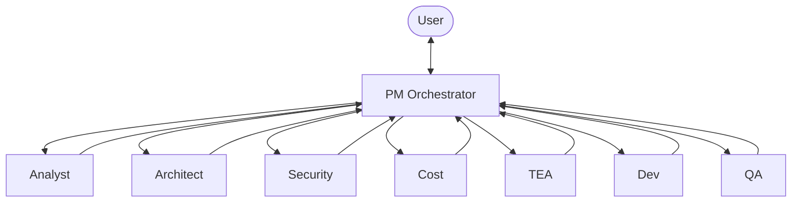
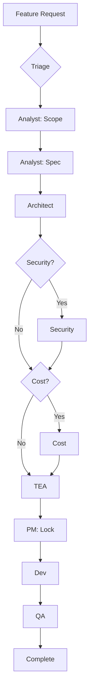
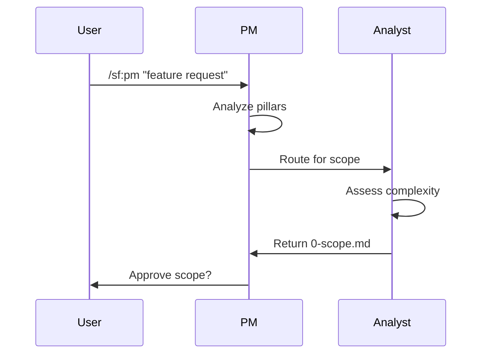
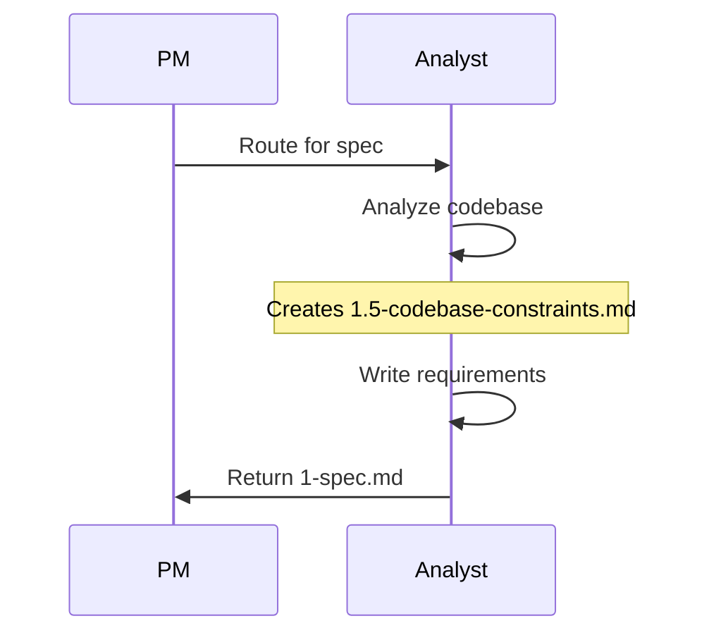
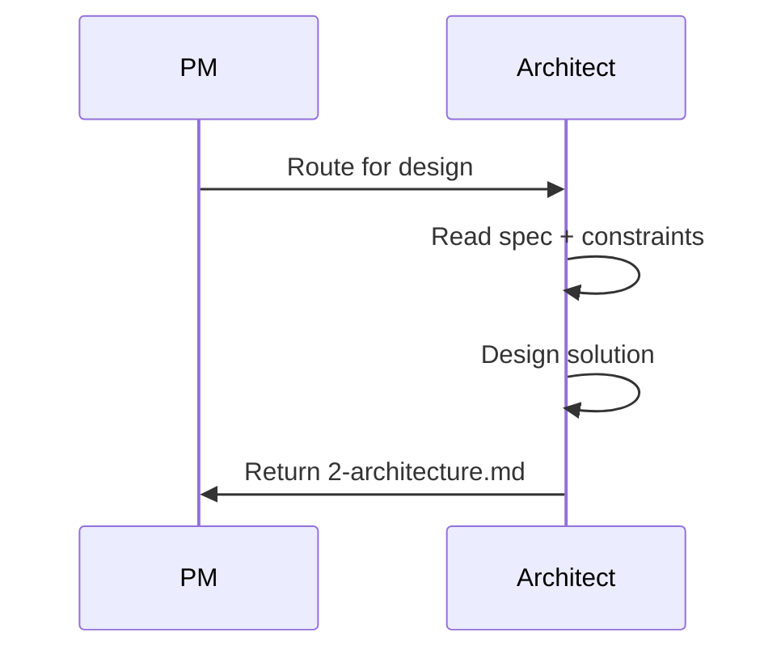
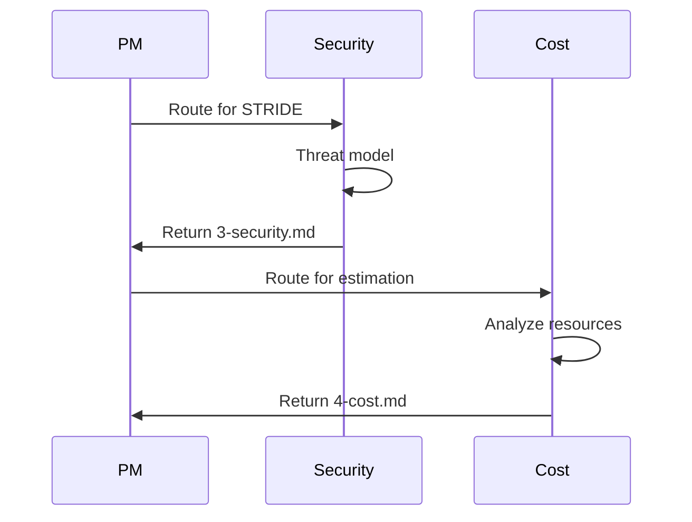
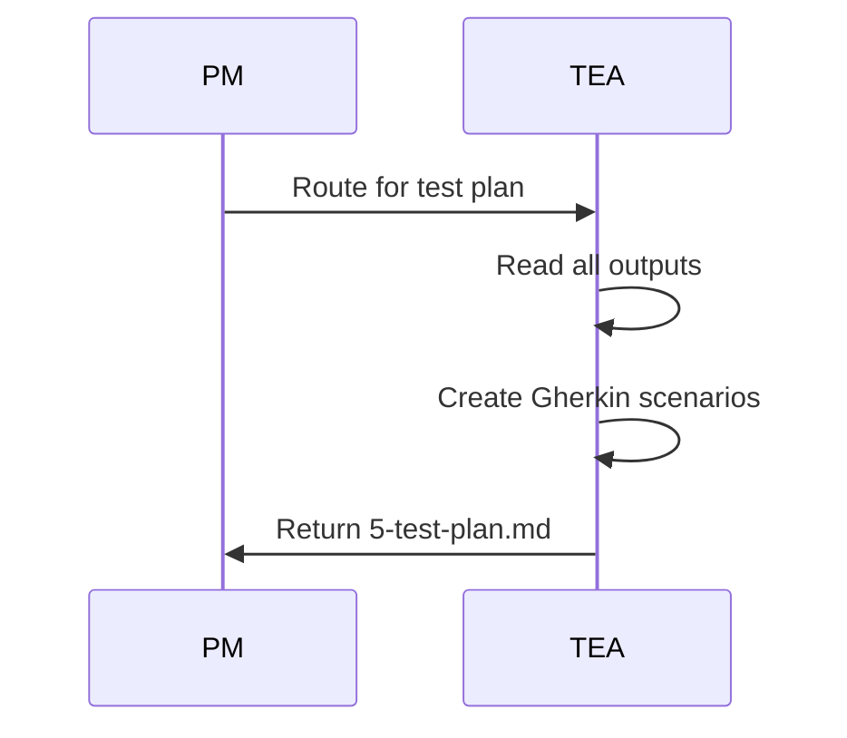
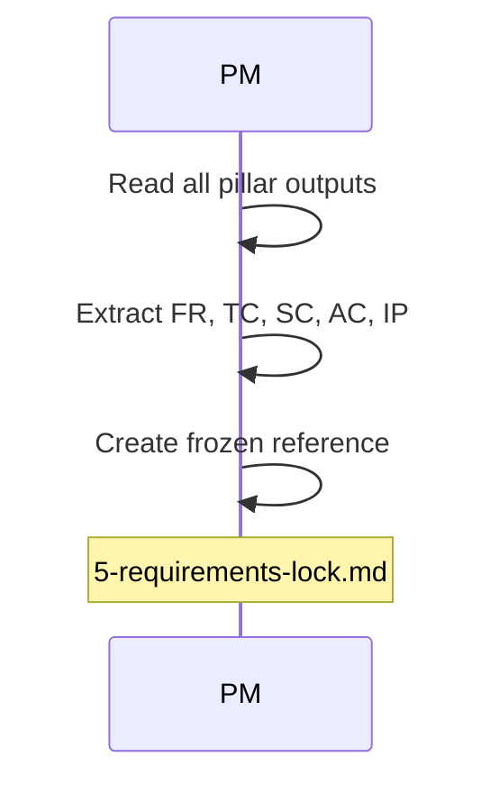
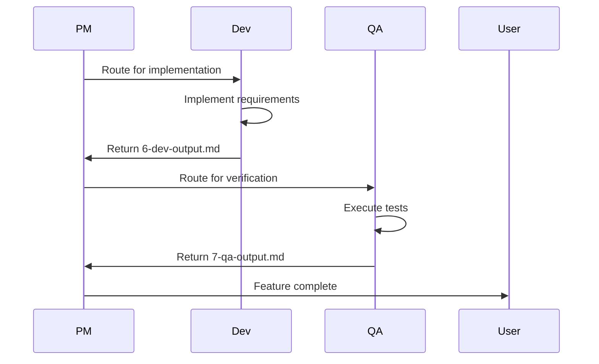

# SpecFlow Architecture

SpecFlow follows a hub-and-spoke architecture where the PM agent orchestrates all other agents. Think of it as a newsroom: the editor (PM) assigns stories to reporters (agents), reviews their drafts, and decides when to publish. No reporter goes directly to print without the editor's approval.

## Core Architecture

The PM sits at the center of all workflows:

Every agent returns to PM after completing their work. PM reviews the output, decides what comes next, and routes accordingly. This pattern enables:

- Drift detection between stages
- Quality gates at each transition
- User involvement only when needed
- Consistent state tracking

## The PM Orchestrator

John (the PM) manages the entire feature lifecycle. When you invoke `/sf:pm`, John:

1. Reads project state from `.specflow/STATE.md`
2. Checks for pending work or conflicts
3. Analyzes your request for pillar triggers
4. Routes to the appropriate agent sequence

### Pillar Triggers

The PM applies rules to determine which pillars need analysis:

| Trigger | Pillar | Example |
|---------|--------|---------|
| Auth, tokens, sessions | Security | Login, JWT handling |
| PII, passwords | Security | User profile |
| Cloud resources | Cost | New database |
| Third-party APIs | Cost | Stripe integration |
| All features | Testing | Everything gets tests |

### Routing Logic

The PM constructs an agent sequence based on triggers:

## Agent Communication

Agents communicate through files, not direct calls. This design choice enables:

- State persistence across sessions
- Audit trail of all decisions
- Resume from any point after interruption
- Clear handoff boundaries

### The File Protocol

Each agent reads specific files and writes specific outputs:

| Agent | Reads | Writes |
|-------|-------|--------|
| Analyst | `0-triage.md` | `0-scope.md`, `1-spec.md` |
| Architect | `0-scope.md`, `1-spec.md` | `2-architecture.md` |
| Security | `1-spec.md`, `2-architecture.md` | `3-security.md` |
| Cost | `2-architecture.md` | `4-cost.md` |
| TEA | All prior outputs | `5-test-plan.md` |
| Dev | All prior outputs | `6-dev-output.md` |
| QA | Test plan, dev output | `7-qa-output.md` |

### State Management

The `STATE.md` file tracks:

- Current feature slug
- Current phase (triage, scope, spec, etc.)
- Last agent that ran
- Next agent to run
- Session continuity information

This enables seamless resume after browser refresh or session timeout.

## Workflow Stages

### Stage 1: Triage and Scope

The PM triages the request, then Analyst assesses scope:

Scope approval is the first user checkpoint. You confirm the scope level (trivial through complex) matches your expectations.

### Stage 2: Specification

After scope approval, Analyst writes detailed requirements:

The codebase analysis (1.5) examines your existing code for patterns, integrations, and constraints.

### Stage 3: Architecture

Architect designs the technical approach:

Architecture depth scales with scope:

| Scope | Architecture Output |
|-------|---------------------|
| trivial | None (skipped) |
| small | Brief summary, no diagrams |
| medium | Summary, ASCII diagrams |
| large | Full doc, multiple diagrams |
| complex | ADRs, C4 diagrams |

### Stage 4: Pillar Analysis

For medium+ scope, Security and Cost agents analyze the design:

### Stage 5: Test Planning

TEA creates test scenarios for all scope levels:

TEA determines whether QA should write tests before Dev implements (qa-first) or after (dev-first).

### Stage 6: Requirements Lock

PM synthesizes all outputs into a requirements lock:

The requirements lock contains:

- Functional Requirements (FR)
- Technical Constraints (TC)
- Security Constraints (SC)
- Acceptance Criteria (AC)
- Integration Points (IP)

### Stage 7: Development and QA

Dev implements, QA verifies:

## Drift Detection

PM runs drift checkpoints after Dev and QA complete. Drift occurs when:

- Implementation misses requirements
- Implementation adds undocumented features
- Test coverage gaps exist

When drift is detected, PM creates correction files and re-routes to the appropriate agent.

## Proportional Ceremony

SpecFlow scales its process to feature complexity:

| Scope | Agents Involved | Documents Produced |
|-------|-----------------|-------------------|
| trivial | PM, Analyst, Dev | 2-3 |
| small | PM, Analyst, Architect, TEA, Dev, QA | 6-7 |
| medium | All agents | 8-9 |
| large | All agents | 10+ |
| complex | All agents + research | 12+ |

Small features should not suffer enterprise process. Complex features should not skip critical analysis. SpecFlow calibrates automatically.

## Skills Architecture

Beyond core agents, SpecFlow supports installable skills:

| Skill Type | Example | Trigger |
|------------|---------|---------|
| Security | app-security | Code review |
| Reporting | executive-reporting | Status request |
| Generation | pptx | Presentation request |

Skills extend SpecFlow without modifying core workflows.

## Summary

SpecFlow architecture ensures:

1. **Central orchestration**: PM controls all routing
2. **File-based state**: Persistent, auditable, resumable
3. **Proportional ceremony**: Scale process to scope
4. **Drift detection**: Catch deviations early
5. **Extensibility**: Add skills without core changes

The architecture serves one goal: ship quality software with confidence.
