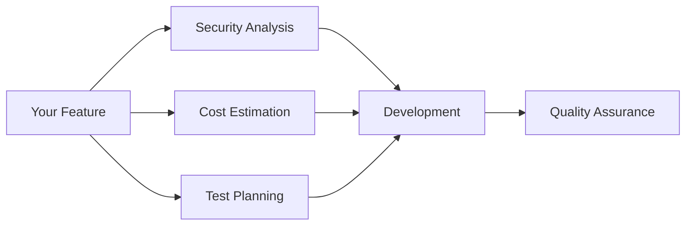

# SpecFlow Documentation

Security-first, cost-aware, test-driven AI development methodology.

## What is SpecFlow?

SpecFlow is a PM-orchestrated development methodology where every feature addresses three pillars before code is written:

- **Security**: Threat modeling with STRIDE
- **Cost**: Cloud resource estimation
- **Testing**: Gherkin scenarios and test planning

## Quick Start

```bash
npx specflow init
/sf:pm "build a user authentication system"
```

## Documentation

- [Getting Started](/docs/getting-started) - Installation and first feature
- [Commands](/docs/commands) - All available slash commands
- [Architecture](/docs/architecture) - How SpecFlow works
- [Methodology](/docs/methodology) - Security, testing, and cost frameworks
- [Agents](/docs/agents) - The personas behind SpecFlow

## The Three Pillars



Every feature flows through these pillars based on its scope:

| Scope | Pillars Applied |
|-------|-----------------|
| trivial | None |
| small | Testing |
| medium | Security + Testing |
| large | All three |
| complex | All three + research |

## How It Works

1. **Invoke PM**: Start with `/sf:pm "your feature"`
2. **Scope Assessment**: Analyst determines complexity
3. **Pillar Analysis**: Security, Cost, Testing review (scope-dependent)
4. **Requirements Lock**: PM synthesizes all outputs
5. **Development**: Dev implements to specification
6. **Verification**: QA validates against test plan

The PM orchestrates everything. You only intervene for scope approval and final review.
