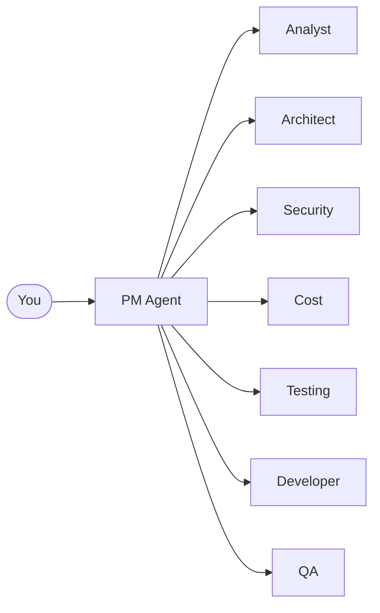

# Getting Started with SpecFlow

*Written by Paige, Technical Writer*

Welcome to SpecFlow! Think of it as having a seasoned development team built right into your terminal. Before you write a single line of code, SpecFlow ensures you have addressed the three pillars that trip up most projects: Security, Cost, and Testing.

## What is SpecFlow?

Imagine you are building a house. You would not start hammering nails without blueprints, permits, and a budget. SpecFlow applies the same wisdom to software: every feature gets its blueprints (architecture), inspections (security review), cost estimates (cloud analysis), and test plans before construction begins.

SpecFlow orchestrates this process through AI agents. Each agent specializes in one aspect of development:



## Installation

Getting started takes one command:

```bash
npx specflow init
```

This creates two directories in your project:

| Directory | Purpose |
|-----------|---------|
| `.specflow/` | Runtime workspace where features are tracked |
| `.specflow-lib/` | Methodology library (read-only reference) |
| `.claude/commands/` | Slash commands for invoking agents |

The init process detects your project type (Node.js, Python, Go, etc.) and configures the workspace accordingly.

## Your First Feature

Starting a new feature is like opening a conversation with your PM:

```bash
/sf:pm "add user logout functionality"
```

The PM agent takes over from here. Think of John (the PM) as your project quarterback. He reads your request, assesses the scope, and orchestrates the right specialists.

### What Happens Next

1. **Triage**: PM analyzes which pillars apply to your feature
2. **Scope Assessment**: Analyst determines feature complexity
3. **Specification**: Analyst writes detailed requirements
4. **Architecture**: Architect designs the technical approach
5. **Pillar Analysis**: Security and Cost review (for medium+ scope)
6. **Test Planning**: TEA creates test scenarios
7. **Development**: Dev implements the feature
8. **Quality Assurance**: QA verifies the implementation

For a simple logout button, the workflow might skip Security and Cost analysis entirely. SpecFlow applies *proportional ceremony*: small features get light process, large features get full treatment.

## The Three Pillars

Every SpecFlow feature addresses three concerns before implementation:

### Security (Jordan)

Jordan applies STRIDE threat modeling to identify vulnerabilities before they become problems. For the logout feature, Jordan might identify:

- Session invalidation requirements
- Token revocation needs
- Redirect URL validation

### Cost (Taylor)

Taylor estimates cloud resource impact. For simple features, this might be "zero additional cost." For features involving new databases or APIs, Taylor provides detailed breakdowns.

### Testing (TEA)

The Test Engineering Analyst creates Gherkin scenarios that become your acceptance criteria. These scenarios drive both development and QA:

```gherkin
Feature: User Logout

  Scenario: User clicks logout button
    Given I am logged in as "user@example.com"
    When I click the logout button
    Then I should be redirected to the login page
    And my session should be invalidated
```

## Understanding Scope Levels

SpecFlow adjusts its ceremony based on feature complexity:

| Scope | Files Changed | Pillars | Example |
|-------|---------------|---------|---------|
| trivial | 1 | None | Fix typo |
| small | 1-3 | Testing only | Logout button |
| medium | 3-10 | Security + Testing | New endpoint |
| large | 10+ | All three | Payment flow |
| complex | Many | All + Research | New service |

The scope level determines:
- How deep the analysis goes
- Which agents are invoked
- How much documentation is produced

## Feature Artifacts

As your feature progresses, SpecFlow creates artifacts in `.specflow/features/{slug}/`:

```
.specflow/features/add-logout-button/
  0-triage.md          # PM's pillar analysis
  0-scope.md           # Analyst's scope assessment
  1-spec.md            # Requirements specification
  2-architecture.md    # Technical design
  3-security.md        # Security analysis (medium+)
  4-cost.md            # Cost analysis (medium+)
  5-test-plan.md       # Test scenarios
  6-dev-output.md      # Implementation summary
  7-qa-output.md       # Test results
  STATUS.md            # Current approval status
  PROGRESS.md          # Work log
```

Each file builds on the previous one, creating a traceable chain from request to implementation.

## Common Commands

| Command | Purpose |
|---------|---------|
| `/sf:pm` | Start or continue a feature |
| `/sf:pm --status` | Check current feature state |
| `/sf:pm --review` | Review completed outputs |
| `/sf:analyst` | Run requirements analysis |
| `/sf:architect` | Run architecture design |
| `/sf:tea` | Run test planning |
| `/sf:dev` | Run development |
| `/sf:qa` | Run quality assurance |

## Tips for Success

**Start small**: Your first feature should be trivial or small scope. Get comfortable with the workflow before tackling complex features.

**Trust the process**: The PM knows when to involve you and when to proceed autonomously. Let the agents work through the pillar analysis before jumping to implementation.

**Read the artifacts**: The documentation SpecFlow produces is not busywork. Security threats, cost estimates, and test scenarios inform better development decisions.

**Iterate**: SpecFlow embraces the philosophy of "ship the smallest thing that validates the assumption." Start with MVP, iterate from feedback.

## Next Steps

Now that you understand the basics:

1. Run `npx specflow init` in your project
2. Start your first feature with `/sf:pm "your feature description"`
3. Follow along as the agents work through the pillars
4. Review the artifacts produced
5. Learn the agent personas and their specialties

Welcome to SpecFlow. You are about to build software with confidence.
