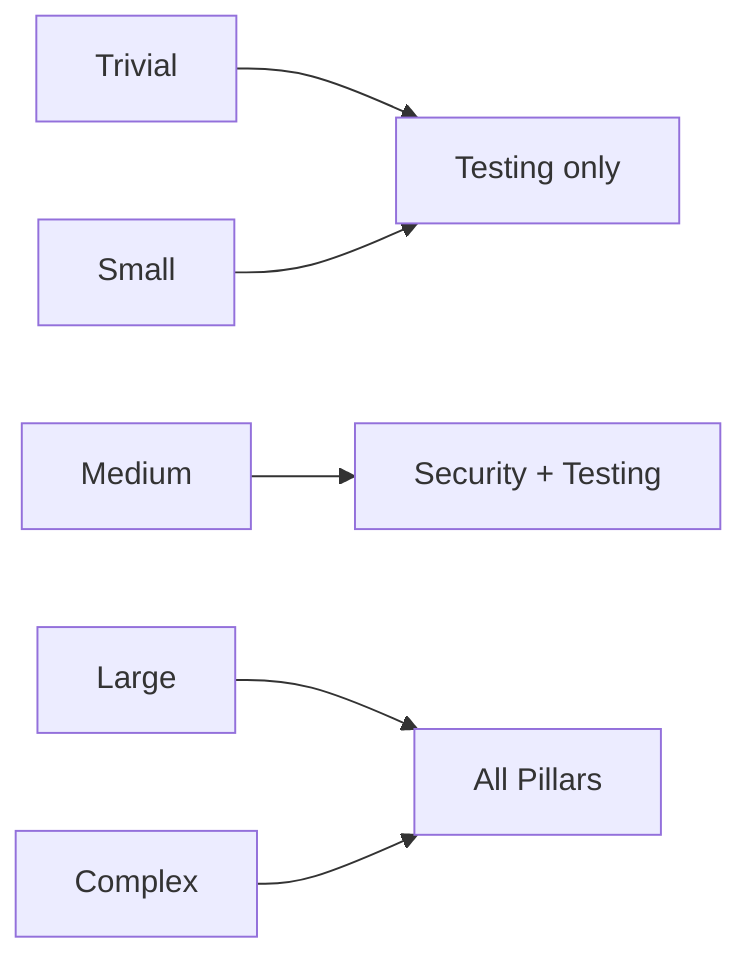
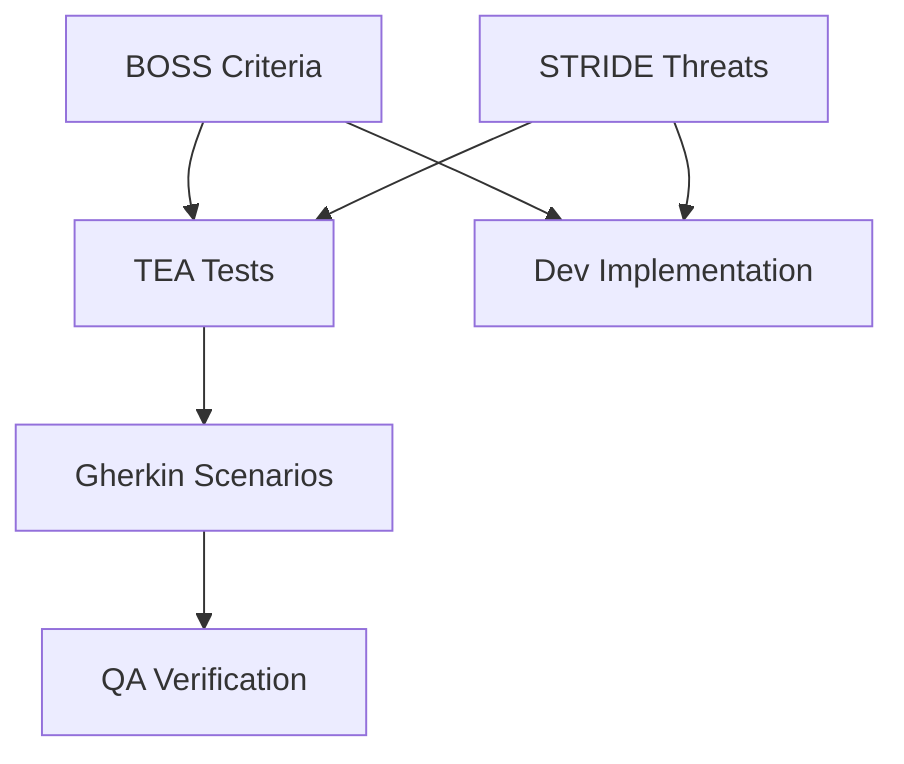

# SpecFlow Methodology

*Written by Paige, Technical Writer*

SpecFlow applies proven frameworks to each pillar. Think of these as checklists that experts have refined over decades. Instead of reinventing the wheel for every feature, you stand on the shoulders of security researchers, cost analysts, and testing practitioners.

## Overview

Each pillar uses specific frameworks:

| Pillar | Framework | Purpose |
|--------|-----------|---------|
| Security | STRIDE | Threat modeling |
| Requirements | BOSS | Acceptance criteria quality |
| Testing | TEA + Gherkin | Test specification |
| Cost | FinOps | Cloud cost analysis |

## STRIDE Threat Modeling

STRIDE is a mnemonic for six threat categories. Security analyst Jordan applies STRIDE to every architecture review:

| Letter | Threat | Question |
|--------|--------|----------|
| **S** | Spoofing | Can attackers impersonate legitimate users? |
| **T** | Tampering | Can data be modified without detection? |
| **R** | Repudiation | Can users deny their actions? |
| **I** | Information Disclosure | Can sensitive data leak? |
| **D** | Denial of Service | Can the system be overwhelmed? |
| **E** | Elevation of Privilege | Can users gain unauthorized access? |

### How STRIDE Works

Jordan analyzes the architecture in seven steps:

1. **Identify assets** requiring protection (user data, credentials, etc.)
2. **Review architecture** diagrams and data flows
3. **Map trust boundaries** (where data crosses security domains)
4. **Identify attack surfaces** (entry points for attackers)
5. **Analyze controls** at each layer
6. **Assess threats** (likelihood and impact)
7. **Recommend mitigations** for each threat

### STRIDE Output

For a login feature, Jordan might produce:

```markdown
## STRIDE Analysis

### Spoofing
**Threat**: Attacker impersonates legitimate user
**Attack Vector**: Credential stuffing, phishing
**Mitigation**: Rate limiting, MFA, secure password hashing

### Information Disclosure
**Threat**: Password or session token exposure
**Attack Vector**: Logging, network sniffing
**Mitigation**: No password logging, HTTPS only, httpOnly cookies
```

### When STRIDE Applies

STRIDE analysis triggers for medium+ scope features involving:

- Authentication or authorization
- User data (PII, passwords, tokens)
- Payment processing
- Public API endpoints
- File uploads
- External service credentials

## BOSS Criteria

BOSS ensures acceptance criteria are testable. The acronym stands for:

| Letter | Meaning | Good Example | Bad Example |
|--------|---------|--------------|-------------|
| **B** | Binary | "Returns 401" | "Handles errors well" |
| **O** | Observable | "Displays toast message" | "User feels satisfied" |
| **S** | Specific | "Under 200ms" | "Fast response" |
| **S** | Scope-bound | "Login endpoint" | "User experience" |

### Writing BOSS Criteria

Analyst Mary transforms vague requirements into BOSS-compliant acceptance criteria:

**Before (vague):**
> User should be able to log out securely

**After (BOSS):**
```markdown
AC-01: When user clicks logout button, session token is invalidated
AC-02: After logout, redirects to login page within 500ms
AC-03: After logout, previous session token returns 401 on API calls
AC-04: Logout button visible on all authenticated pages
```

Each criterion is:
- **Binary**: Either the token is invalidated or it is not
- **Observable**: Can test via API call
- **Specific**: Exact behavior defined
- **Scope-bound**: Only covers logout functionality

### The BOSS Test

Before finalizing any acceptance criterion, apply the BOSS test:

```
Can a test script verify this criterion passes or fails?
```

If yes, the criterion is BOSS-compliant. If no, refine until it is.

## Test Engineering Analysis (TEA)

TEA plans tests at the right depth for each scope level. Think of TEA as your test architect who ensures every requirement has verification.

### Test Depth by Scope

| Scope | Test Scenarios | Types |
|-------|----------------|-------|
| trivial | 1-2 | Happy path only |
| small | 3-5 | Happy + one error case |
| medium | 6-10 | Full Gherkin coverage |
| large | 10-15 | Integration + E2E |
| complex | 15+ | Performance, security |

### Gherkin Scenarios

TEA writes tests in Gherkin format, which reads like natural language:

```gherkin
Feature: User Authentication

  @AC-01 @happy-path
  Scenario: Successful login with valid credentials
    Given I am on the login page
    And user "test@example.com" exists with password "SecurePass123"
    When I enter "test@example.com" as email
    And I enter "SecurePass123" as password
    And I click the login button
    Then I should be redirected to the dashboard
    And my session should be active

  @AC-02 @error-case
  Scenario: Failed login with invalid password
    Given I am on the login page
    And user "test@example.com" exists with password "SecurePass123"
    When I enter "test@example.com" as email
    And I enter "WrongPassword" as password
    And I click the login button
    Then I should see error message "Invalid credentials"
    And I should remain on the login page
```

### Traceability Matrix

TEA creates a matrix linking acceptance criteria to tests:

| AC | Unit | Integration | E2E | Coverage |
|----|------|-------------|-----|----------|
| AC-01 | UT-01 | IT-01 | E2E-01 | FULL |
| AC-02 | UT-02 | - | E2E-02 | FULL |
| AC-03 | - | IT-02 | - | PARTIAL |
| AC-04 | - | - | - | MISSING |

MISSING coverage triggers PM review before development proceeds.

### Flow Recommendation

TEA recommends whether QA should write tests before (qa-first) or after (dev-first) development:

**qa-first** when:
- Feature is behavior-heavy (E2E scenarios dominate)
- Most AC describe user-facing behavior
- Replacing existing functionality (regression risk)

**dev-first** when:
- Feature is algorithm-heavy (unit tests dominate)
- Most AC describe internal behavior
- Greenfield with no existing contracts

## Cost Analysis Framework

Taylor applies FinOps principles to estimate cloud costs:

### Five-Step Process

1. **Identify resources** created or modified by the feature
2. **Estimate usage** patterns (requests per day, storage growth)
3. **Calculate costs** using cloud pricing
4. **Compare alternatives** (different instance types, regions)
5. **Recommend optimizations** (reserved capacity, auto-scaling)

### Cost Output by Scope

| Scope | Analysis Depth |
|-------|----------------|
| trivial/small | Skipped |
| medium | Total estimate only |
| large | Breakdown by component |
| complex | Multi-scenario projections |

### Sample Cost Analysis

```markdown
## Cost Estimate

**Monthly Total**: $47/month (production)

### Breakdown

| Component | Estimate | Notes |
|-----------|----------|-------|
| Lambda | $12 | 100K requests @ $0.20/M |
| DynamoDB | $25 | 1GB + 10K read/write units |
| CloudWatch | $10 | Logs + metrics |

### Optimization Opportunities

1. Reserved capacity: -30% on DynamoDB
2. Scheduled scaling: -20% during off-hours
3. Consider: Lambda provisioned vs on-demand
```

## Proportional Ceremony

SpecFlow applies methodology proportional to risk:



A typo fix should not trigger STRIDE analysis. A payment integration should not skip it.

## Scope-Based Framework Depth

| Framework | Trivial | Small | Medium | Large | Complex |
|-----------|---------|-------|--------|-------|---------|
| STRIDE | Skip | Skip | Light | Full | Deep |
| BOSS | 1-2 AC | 3-5 AC | 6-10 AC | 10-15 AC | 15+ AC |
| TEA | 1 test | 3-5 tests | 6-10 tests | 10-15 tests | 15+ tests |
| FinOps | Skip | Skip | Estimate | Breakdown | Projections |

## Framework Integration

The frameworks reinforce each other:



- BOSS criteria define what to build
- STRIDE identifies what could go wrong
- TEA ensures everything is testable
- Gherkin makes tests readable
- QA verifies everything works

## Applying Frameworks

You do not need to memorize these frameworks. The agents apply them automatically:

1. `/sf:pm` routes to `/sf:analyst` for BOSS criteria
2. `/sf:pm` routes to `/sf:security` for STRIDE analysis
3. `/sf:pm` routes to `/sf:tea` for test planning
4. `/sf:pm` routes to `/sf:cost` for FinOps analysis

Your role is to review the outputs and approve scope. The frameworks work behind the scenes.

## Summary

SpecFlow methodology ensures:

- **Security**: STRIDE catches threats before code is written
- **Quality**: BOSS criteria are testable and specific
- **Verification**: TEA creates comprehensive test coverage
- **Cost**: FinOps estimates resource impact early

These frameworks prevent the common failure mode: discovering problems after implementation when fixes are expensive.
