# SpecFlow Architecture

SpecFlow follows a hub-and-spoke architecture where the PM agent orchestrates all other agents. Think of it as a newsroom: the editor (PM) assigns stories to reporters (agents), reviews their drafts, and decides when to publish. No reporter goes directly to print without the editor's approval.

## Core Architecture

The PM sits at the center of all workflows:

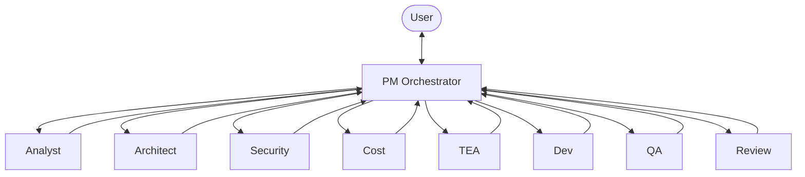

Every agent returns to PM after completing their work. PM reviews the output, decides what comes next, and routes accordingly. This pattern enables:

- Drift detection between stages
- Quality gates at each transition
- User involvement only when needed
- Consistent state tracking

## The PM Orchestrator

John (the PM) manages the entire feature lifecycle. When you invoke `/sf:pm`, John:

1. Reads project state from `.specflow/STATE.md`
2. Checks for pending work or conflicts
3. Analyzes your request for pillar triggers
4. Routes to the appropriate agent sequence

### Pillar Triggers

The PM applies rules to determine which pillars need analysis:

| Trigger | Pillar | Example |
|---------|--------|---------|
| Auth, tokens, sessions | Security | Login, JWT handling |
| PII, passwords | Security | User profile |
| Cloud resources | Cost | New database |
| Third-party APIs | Cost | Stripe integration |
| All features | Testing | Everything gets tests |

### Routing Logic

The PM constructs an agent sequence based on triggers:

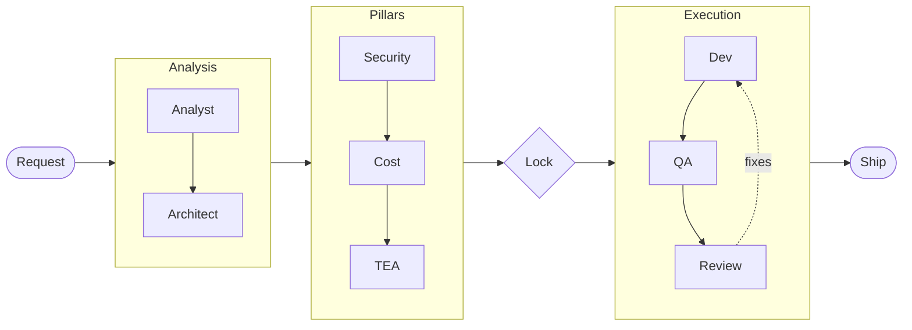

**Flow**: Request → Analyst → Architect → Security → Cost → TEA → Lock → Dev → QA → Review → Ship

## Agent Communication

Agents communicate through files, not direct calls. This design choice enables:

- State persistence across sessions
- Audit trail of all decisions
- Resume from any point after interruption
- Clear handoff boundaries

### The File Protocol

Each agent reads specific files and writes specific outputs:

| Agent | Reads | Writes |
|-------|-------|--------|
| Analyst | `0-triage.md` | `0-scope.md`, `1-spec.md` |
| Architect | `0-scope.md`, `1-spec.md` | `2-architecture.md` |
| Security | `1-spec.md`, `2-architecture.md` | `3-security.md` |
| Cost | `2-architecture.md` | `4-cost.md` |
| TEA | All prior outputs | `5-test-plan.md` |
| PM | All pillar outputs | `5-requirements-lock.md`, `5.5-epics.md`, `stories/*.md` |
| Dev | Story files, prior outputs | `6-dev-output.md` |
| QA | Test plan, dev output | `7-qa-output.md` |
| Review | Dev output, spec, scope | `8-review-output.md` |

### State Management

The `STATE.md` file tracks:

- Current feature slug
- Current phase (triage, scope, spec, etc.)
- Last agent that ran
- Next agent to run
- Session continuity information

This enables seamless resume after browser refresh or session timeout.

## Workflow Stages

### Stage 1: Triage and Scope

The PM triages the request, then Analyst assesses scope:

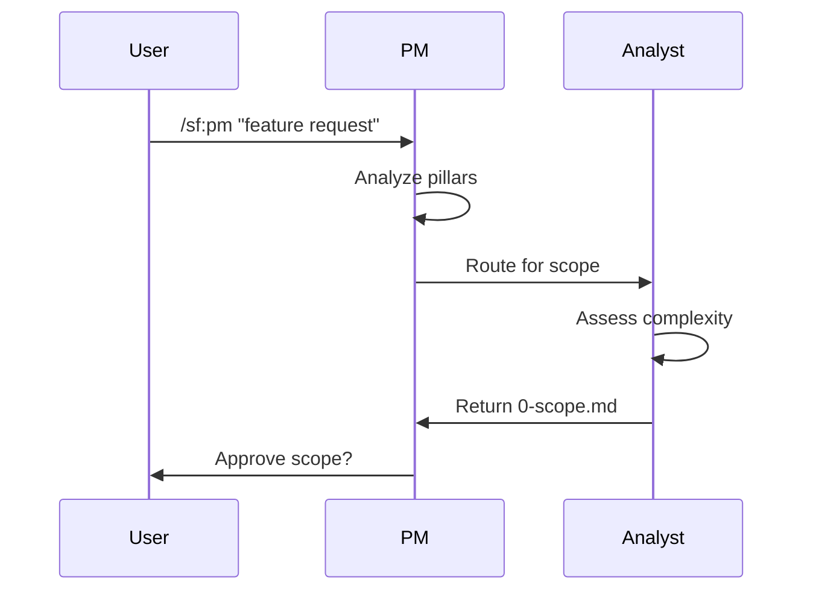

Scope approval is the first user checkpoint. You confirm the scope level (trivial through complex) matches your expectations.

### Stage 2: Specification

After scope approval, Analyst writes detailed requirements:

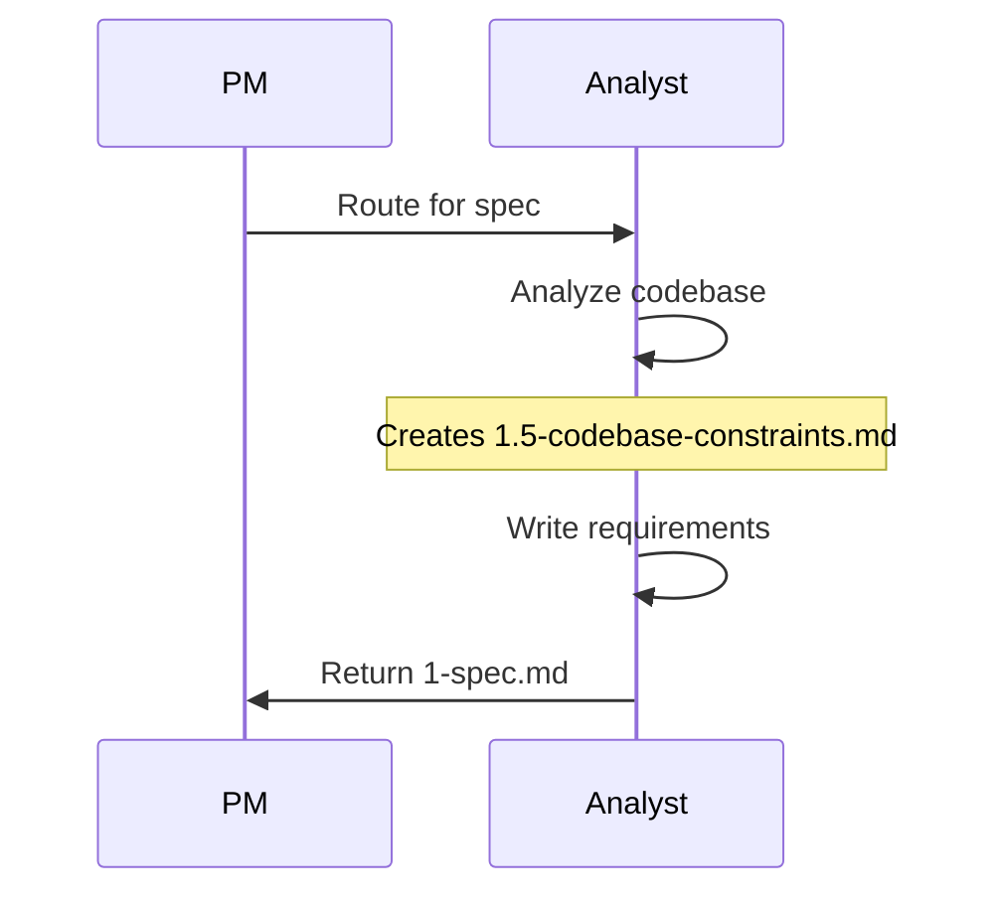

The codebase analysis (1.5) examines your existing code for patterns, integrations, and constraints.

### Stage 3: Architecture

Architect designs the technical approach:

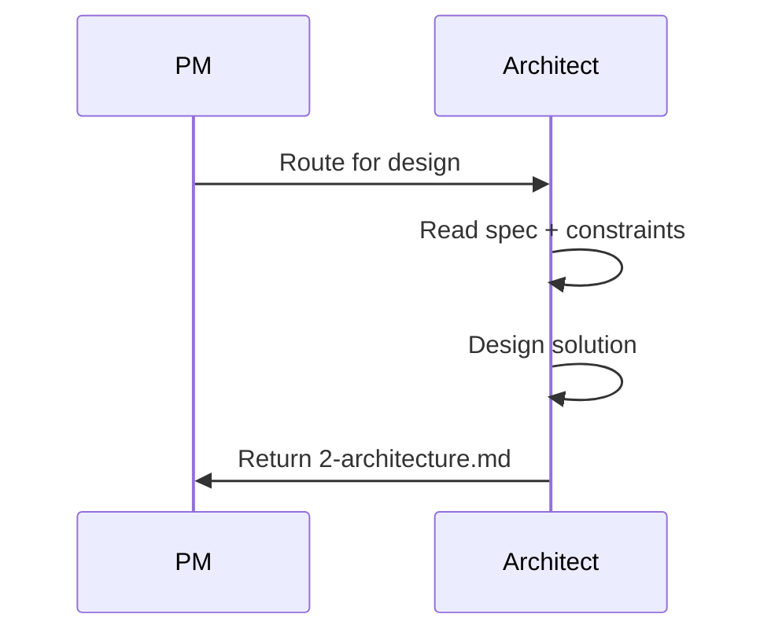

Architecture depth scales with scope:

| Scope | Architecture Output |
|-------|---------------------|
| trivial | None (skipped) |
| small | Brief summary, no diagrams |
| medium | Summary, ASCII diagrams |
| large | Full doc, multiple diagrams |
| complex | ADRs, C4 diagrams |

### Stage 4: Pillar Analysis

For medium+ scope, Security and Cost agents analyze the design:

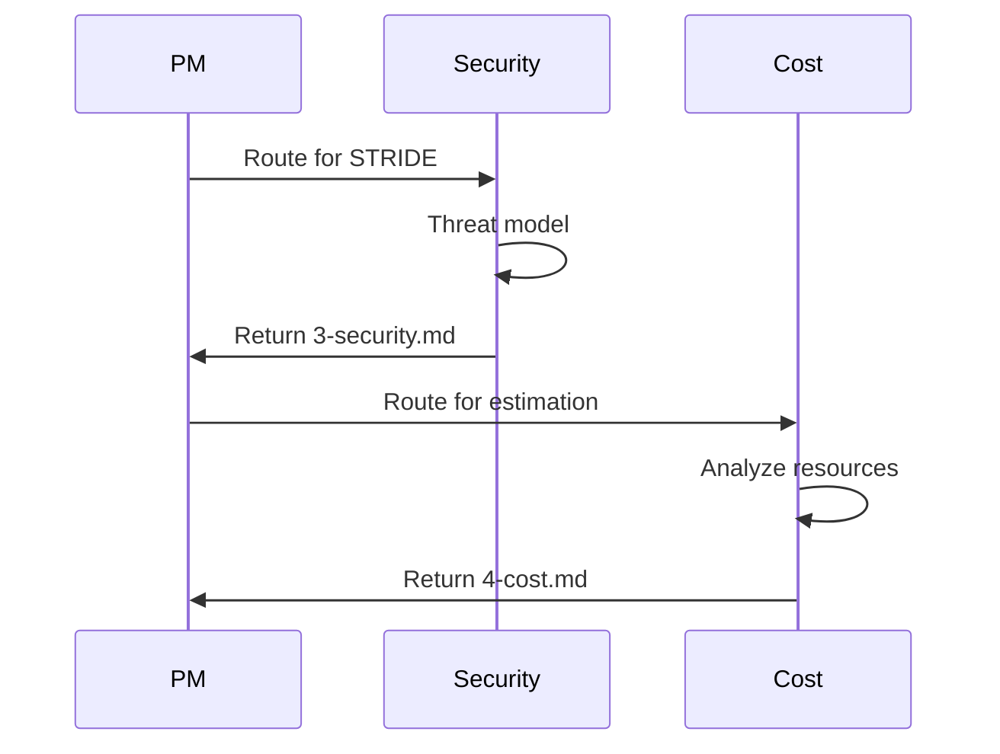

### Stage 5: Test Planning

TEA creates test scenarios for all scope levels:

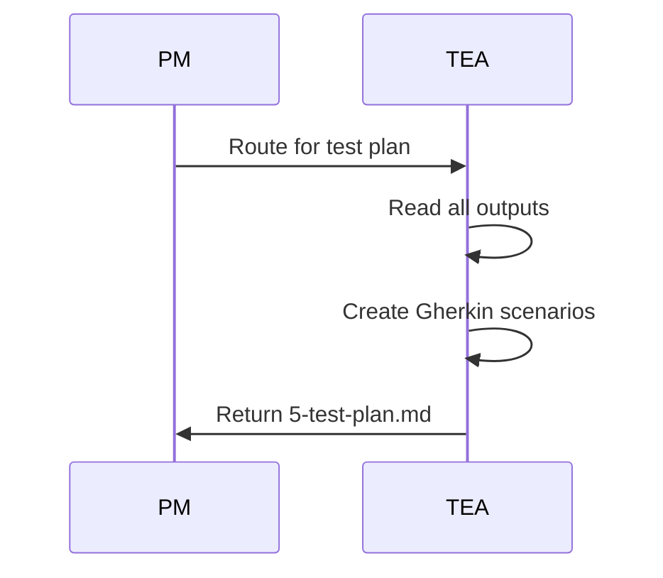

TEA determines whether QA should write tests before Dev implements (qa-first) or after (dev-first).

### Stage 6: Requirements Lock

PM synthesizes all outputs into a requirements lock:

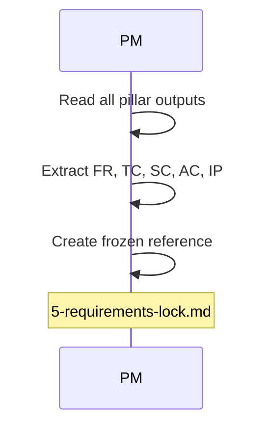

The requirements lock contains:

- Functional Requirements (FR)
- Technical Constraints (TC)
- Security Constraints (SC)
- Acceptance Criteria (AC)
- Integration Points (IP)

### Stage 6.5: Epic and Story Generation (Medium+ Scope)

For medium and larger features, PM generates epics and stories before development:

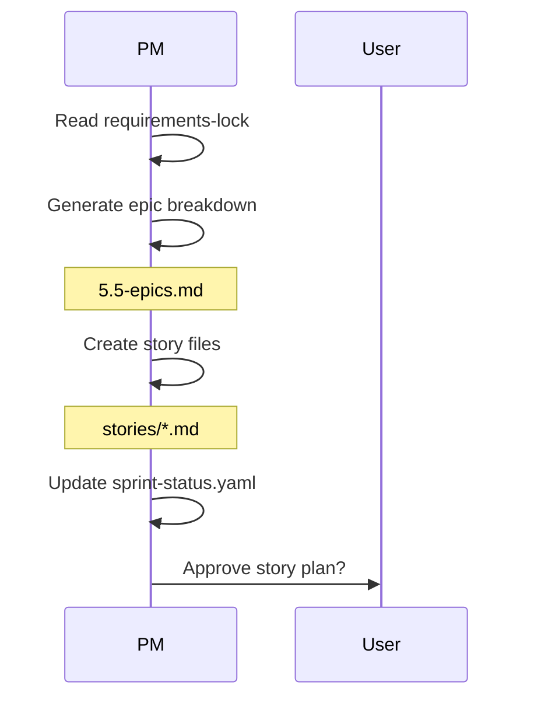

Each story includes:

- BOSS-validated acceptance criteria
- Story points estimation
- Dependency mapping
- Interface contracts (for stories with dependents)

#### Sprint Planning

After stories are approved, PM plans capacity:

```
Sprint Capacity: 20 points

Selected Stories:
1. Auth Setup (3 pts) - P1
2. Session Management (5 pts) - P1
3. Login Form (3 pts) - P1

Total: 11 points (55% capacity)
Buffer: 9 points for bugs/unknowns
```

### Stage 7: Development and QA

Dev implements, QA verifies:

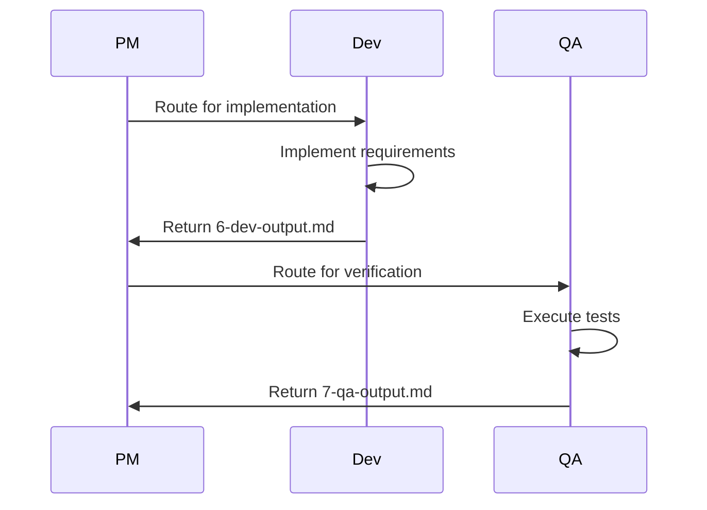

#### Wave-Based Parallel Execution (Large Features)

For features with multiple stories, PM calculates execution waves based on dependencies:

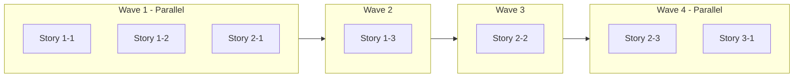

Stories within the same wave have no dependencies and can execute in parallel. PM spawns all stories in a wave simultaneously using the Task tool.

**Wave calculation rules:**
- Stories with no dependencies start in Wave 1
- Stories wait for their dependencies to complete
- File overlap detection prevents conflicts
- `parallel_safe: true` marks stories safe for concurrent execution

**Example sprint-status.yaml:**

```yaml
stories:
  - id: 1-1-redis-client
    wave: 1
    parallel_safe: true
    depends_on: []
  - id: 1-2-config
    wave: 1
    parallel_safe: true
    depends_on: []
  - id: 1-3-sliding-window
    wave: 2
    parallel_safe: false
    depends_on: [1-1-redis-client]
```

### Stage 8: Multi-Lens Review

After Dev and QA complete, Review runs parallel skill-based analysis:

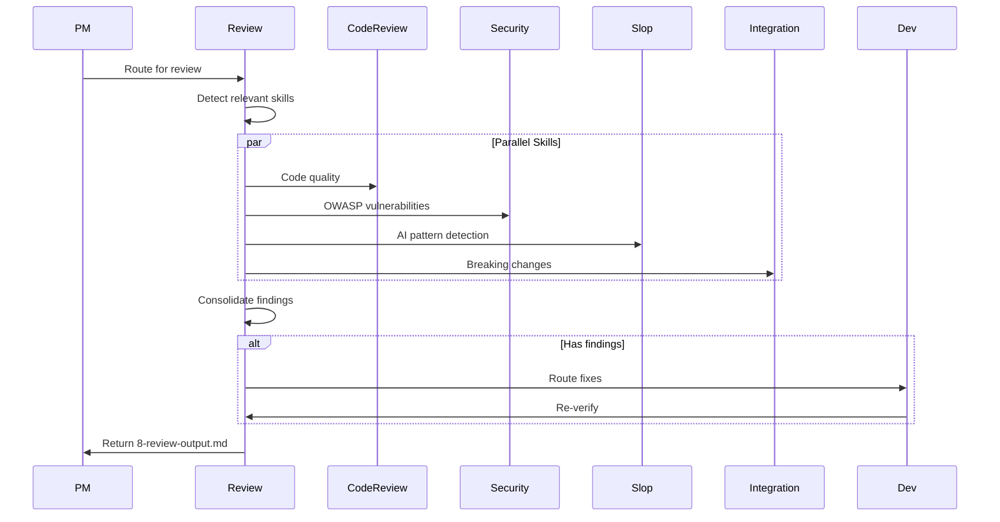

Review spawns skills based on file patterns and scope:

| Scope | Skills Run |
|-------|------------|
| small | code-review-excellence, app-security |
| medium | + slop-detection, integration-review |
| large | + database-security |
| complex | + semantic-drift |

#### Security Review

Security skills run on every review loop, analyzing for:

- OWASP Top 10 vulnerabilities
- SQL injection, XSS, CSRF
- Authentication and session issues
- Secrets and credential exposure

#### Slop Detection

Detects common AI-generated anti-patterns:

- Unnecessary abstractions
- Over-engineered solutions
- Redundant error handling
- Framework reimplementations

#### Fix Loop

Review runs up to 3 iterations:

1. **v1**: Full review, findings documented
2. **v2**: Verify fixes, focused re-review
3. **v3**: Final check or escalate to PM

CRITICAL findings that persist after iteration 2 escalate to PM for user decision.

## Drift Detection

PM runs drift checkpoints after Dev and QA complete. Drift occurs when:

- Implementation misses requirements
- Implementation adds undocumented features
- Test coverage gaps exist

When drift is detected, PM creates correction files and re-routes to the appropriate agent.

## Proportional Ceremony

SpecFlow scales its process to feature complexity:

| Scope | Agents Involved | Documents Produced |
|-------|-----------------|-------------------|
| trivial | PM, Analyst, Dev | 2-3 |
| small | PM, Analyst, Architect, TEA, Dev, QA, Review | 7-8 |
| medium | All agents | 9-10 |
| large | All agents | 11+ |
| complex | All agents + research | 13+ |

Small features should not suffer enterprise process. Complex features should not skip critical analysis. SpecFlow calibrates automatically.

## Tracker Integration (Upcoming)

SpecFlow will sync with external trackers for end-to-end autonomous development:

| Tracker | Epic Type | Story Type |
|---------|-----------|------------|
| GitHub | Issue + `epic` label | Issue + `story` label |
| Jira | Epic issue type | Story issue type |
| Linear | Project | Issue |
| Rally | Feature | User Story |

**Planned capabilities:**

- **Auto-create tickets**: Generate epics and stories in your tracker from SpecFlow specs
- **Bidirectional sync**: Pull stories from backlog, push status updates back
- **Autonomous development**: Pick up stories, implement, create PRs, update tracker status
- **Sprint automation**: Auto-assign stories based on capacity and dependencies

The `/sf:scrum` command will manage this integration:

```
/sf:scrum create-epic "User Authentication"
/sf:scrum create-story --epic AUTH-1 "Login form"
/sf:scrum sprint-board
/sf:scrum auto-develop --sprint current
```

Sprint boards will show real-time status:

```
Current Sprint: Sprint 5
Capacity: 20 pts | Committed: 18 pts

TODO (6 pts)    IN PROGRESS (8 pts)    DONE (4 pts)
-----------     ------------------     -----------
[ ] Profile     [>] Login              [x] Setup
[ ] Avatar      [>] Session            [x] Config
```

## Skills Architecture

Beyond core agents, SpecFlow supports installable skills:

| Skill Type | Example | Trigger |
|------------|---------|---------|
| Security | app-security | Code review |
| Reporting | executive-reporting | Status request |
| Generation | pptx | Presentation request |

**Install skills from the registry:**

```bash
npx specflow skill install app-security
npx specflow skill install pptx@anthropics/skills
npx specflow skill list
```

Skills extend SpecFlow without modifying core workflows.

## Summary

SpecFlow architecture ensures:

1. **Central orchestration**: PM controls all routing
2. **File-based state**: Persistent, auditable, resumable
3. **Proportional ceremony**: Scale process to scope
4. **Wave-based parallelism**: Execute independent stories concurrently
5. **Multi-lens review**: Security, slop, and integration checks
6. **Drift detection**: Catch deviations early
7. **Tracker integration** (upcoming): Sync with GitHub, Jira, Linear, Rally
8. **Extensibility**: Add skills without core changes

The architecture serves one goal: ship quality software with confidence.
